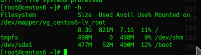
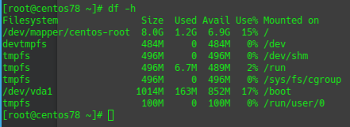
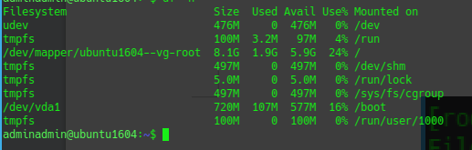
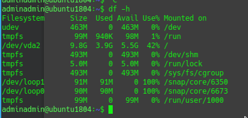
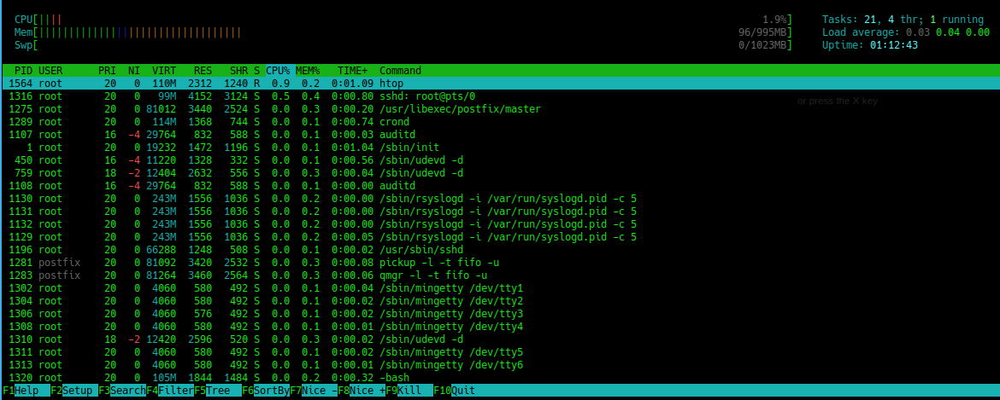
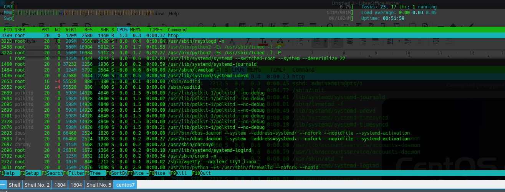
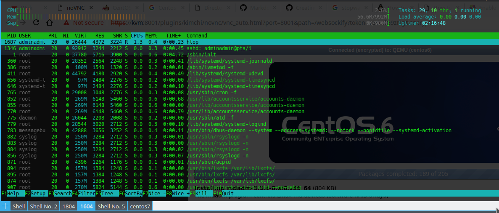
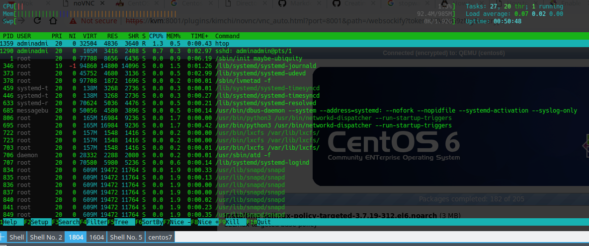

# Centos vs Ubuntu

Así que durante mucho tiempo siempre me he preguntado qué distribución de Linux Server debería elegir para nosotros. Comencé con Centos 6 en 2011, ya que este era el servidor linux que estaba cuidando en el trabajo. Luego encontré sobre Ubuntu, ya que esta es mi distribución de escritorio de Ubuntu para mi controlador diario de Linux, Ubuntu parece una buena opción. Actualmente tengo una caja Centos 6 que ejecuta mi servidor de correo y un servidor Ubuntu que se ejecuta en un VPS para mis diversos sitios web.

Así que quiero ver cuáles son las principales diferencias entre Centos y Ubuntu y en qué servidor debo centrarme. Quiero esta guía como refence para que si tuviera que configurar un servidor tuviera algo a lo que referirme.

Configuro una caja KVM e instalo la siguiente máquina virtual con la siguiente distribución de servidor: Centos 6,7 y Ubuntu 16.04 LTS y 18.04 LTS. Cada 1 vCPU 1GB Ram, 10GB HD.

## Instalación

Lo que implica establecer una distribución:

### Centos 6

1.  Comprobación de medios.
2.  Selección de idioma.
3.  Configuración del teclado.
4.  Encuentra el disco y formateará / particionará por usted.
5.  Establezca el nombre de host y Configure network\*.
6.  Seleccione la zona horaria.
7.  Establezca la contraseña de root.
8.  Elija El tipo de instalación: el valor predeterminado es reemplazar el sistema de archivos existente
9.  Las instalaciones terminan instalando paquetes.

Tiempo de instalación: 17 minutos

\* Recuerde cuidadosamente no perderse el cuadro "configurar red" en la esquina inferior derecha y recuerde seleccionar "conectarse a la red automáticamente". Si no es así, cuando arranque, no obtendrá ningún acceso a la red

### Centos 7

1.  Menú para comprobar si quieres instalar centos 7
2.  Selección de idioma.
3.  Resumen de la instalación, elija qué disco duro utilizar y configure los ajustes de red.
4.  La instalación comienza y luego se le presenta para establecer la contraseña raíz y crear una cuenta de usuario es necesario, mientras se realiza la instalación.
5.  Establezca el nombre de host y Configure network\*.
6.  Seleccione la zona horaria.
7.  Establezca la contraseña de root.
8.  Elija El tipo de instalación: el valor predeterminado es reemplazar el sistema de archivos existente
9.  Las instalaciones terminan instalando paquetes.

Tiempo de instalación: 62 minutos.

Esto se instala en unos 20 minutos, pero luego tarda años en realizar la tarea posterior a la instalación (42 minutos). Este es un error conocido que instala centos 7 en KVM VM.

https://bugs.centos.org/view.php?id=14980#bugnotes

### Ubuntu 16.04 LTS

1.  Selección de idioma.
2.  Menú para elegir instalar Ubuntu 16.04
3.  Seleccione Distribución del teclado.
4.  Configure el nombre de host.
5.  Crear usuario y contraseña.
6.  Decida si desea cifrar la partición de inicio.
7.  Establecer zona horaria
8.  Introduzca la dirección del servidor Prxoy si es necesario.
9.  Seleccione si desea instalar actualizaciones automáticamente.
10. Seleccione los paquetes que desea instalar. Elegí SSH Server.

Tiempo de instalación: 28 minutos.

### Ubuntu 18.04 LTS

1.  Selección de idioma.
2.  Menú para elegir instalar Ubuntu 16.04
3.  Seleccione Distribución del teclado.
4.  Configure los ajustes de IP.
5.  Introduzca la dirección del servidor proxy si es necesario.
6.  Seleccione espejo para obtener software adicional.
7.  Particionar el disco (opción predeterminada: guiado use todo el disco y no use LVM)
8.  Crear usuario y contraseña.
9.  Decida si desea cifrar la partición de inicio.
10. Crear usuario y contraseña.
11. Seleccione los paquetes que desea instalar. Elegí SSH Server.

Tiempo de instalación: 24 minutos.

## Configurar red

En las instalaciones anteriores configuro el servidor para obtener su dirección IP usando DHCP, ahora quiero saber qué tan fácil es configurar una dirección IP estática en el servidor.

### Centos 6

Para ver la configuración actual de la NIC y la dirección IP:

    ifconfig 

El archivo IP Config se encuentra en:

    /etc/sysconfig/network-scripts/ifcfg-eth0 

Agregue los siguientes detalles para configurar la dirección IP estática:

    IPADDR=192.168.127.80
    SUBNET=24
    GATEWAY=192.168.127.1

Para reiniciar la red:

    service network restart 

Para establecer el nombre de host, edite los siguientes archivos y reinicie el host:

```
/etc/sysconfig/network

```

y

    /etc/hosts

Para editar la configuración de DNS, edite el siguiente archivo:

    /etc/resolv.conf

### Centos 7

Para ver la configuración actual de la NIC y la dirección IP

    ip address

Tipo `nmtui` en el terminal para abrir el administrador de red para configurar thr ip settings . Esto puede configurar las opciones de IP y Hostname.

Utilice el followinf para aplicar la configuración.

    systemctl restart network

De nuevo la configuración de red ubicada en este archivo:

    /etc/sysconfig/network-scripts/ifcfg-eth0 

### Ubuntu 16.04 LTS

Edite el siguiente archivo:

    /etc/network/interfaces

Suprímase lo siguiente:

    iface ens32 inet dhcp

añádase lo siguiente:

    auto ens32
    iface ens32 inet static 
    address 192.168.127.19
    netmask 255.255.255.0 
    gateway 192.168.127.1
    dns-search domain.local
    dns-nameservers 192.168.127.10

reiniciar la red

    sudo ifdown ens32 && sudo ifup ens32

o

    systemctl restart networking.service

### Ubuntu 18.04 LTS

Ubuntu 18.04 utiliza netplan para configurar interfaces de red.

Edite el siguiente archivo:

    /etc/netplan/50-cloud-init.yaml

y cambiar a lo siguiente:

    network:
        version: 2
        ethernets:
            enp0s25:
                dhcp4: no
                addresses: [192.168.127.200/24]
                gateway4: 192.168.127.10
                nameservers:
                    addresses: [192.168.127.10]

Ejecute el siguiente comando para aplicar la configuración

    sudo netplan --debug  apply

## Configurar actualizaciones

Después de la instalación base necesitábamos actualizar el sistema.

### Centos 6

Actualizar Cmd:
`yum -y update`

20 paquetes para actualizar: 89MB

Tiempo para instalar las actualizaciones: 7 minutos

### Centos 7

Actualizar Cmd:
`yum -y update`

63 paquetes para actualizar: 129MB

Tiempo para instalar las actualizaciones: 12 minutos

### Ubuntu 16.04 LTS

Actualizar Cmd:
`sudo apt update` y `  sudo apt install `

39 paquetes para actualizar: 15MB

Tiempo para instalar las actualizaciones: 7 minutos

### Ubuntu 18.04 LTS

Actualizar Cmd:
`sudo apt update` y `  sudo apt install `

78 paquetes para actualizar: 30MB

Tiempo para instalar las actualizaciones: 13 minutos

## Configurar SSH

Lo siguiente que hago después de la instalación es configurar SSH para que pueda acceder de forma remota al servidor.

### Centos 6 y 7

El servidor SSH ya está instalado e iniciado, pero no puede iniciar sesión con la cuenta raíz y la contraseña. Sé que esto no es seguro, pero está bien para esta prueba. Así que habilito el inicio de sesión raíz y la autenticación de contraseña a través de ssh:

Edite el siguiente archivo

    /etc/ssh/sshd_config

Comentamos las siguientes líneas:

    PermitRootLogin = yes
    PasswordAuthentication yes

Reinicie el servicio SSHD

    service sshd restart

### Ubuntu 16.04 y 18.04 LTS

Habilité esto como parte de la configuración. Así que no es necesario configurarlo aquí.

## Diseño del disco duro

Todas las distribuciones esperan que Ubuntu 18.04 parezca estar utilizando LVM como una gestión lógica de volúmenes, si decide elegir las opciones de partición predeterminadas en el instalador.

Los siguientes comandos parecen funcionar en las cuatro distribuciones

    df -h
    cat /etc/fstab 
    lvdisplay
    pvdisplay
    lvmdiskscan
    fdisk -l

### Centos 6



### Centos 7



### Ubuntu 16.04 LTS



### Ubuntu 18.04 LTS



## Rendimiento del sistema y proceso de Daemon

Todas las distribuciones que usan systemd esperan Centos 6 que está usando init.d como en el sistema de control.

Las 4 distribuciones parece que puede usar los siguientes comandos para detener e iniciar servicios

    service httpd start|stop|restart

En la distribución systemd esto parece ser un acceso directo al systemctl cmd que se utiliza para controlar los servicios en systemd.

Para habilitar los servicios en el inicio. En Centos 6 puedes utilizar:

    chkconfig httpd on

Para Centos 7, Ubuntu 16.04 y 18.04 Use el siguiente systemctl cmd:

    systemctl enable httpd

A continuación se muestra la salida htop de las cargas del sistema de cada sistema cuando el sistema está inactivo.

### Centos 6



### Centos 7



### Ubuntu 16.04 LTS



### Ubuntu 18.04 LTS



## Cortafuegos

### Centos 6

De forma predeterminada, se trata de tablas IP y está habilitada de forma predeterminada. Utilice el siguiente comando para ver las reglas de firewall actuales

    iptables --line -vnL

Las reglas predeterminadas permiten que se permita el tráfico saliente y todo el tráfico entrante es el puerto de espera de bloqueo 22, que permite la entrada de conexiones SSH.

Para deshabilitar el firewall:

    service iptables stop

Para permitir el puerto 80:

    iptables -I INPUT 5 -i eth0 -p tcp --dport 80 -m state --state NEW,ESTABLISHED -j ACCEPT

Para confirmar cambios:

    service iptables save
    service iptables restart

### Centos 7

De forma predeterminada, Centos 7 utiliza firewall y está habilitado de forma predeterminada y permite el tráfico saliente y entrante del puerto 22.

Para deshabilitar el firewall:

    systemctl stop firewalld

Más información a seguir...

### Ubuntu 16.04 y 18.04 LTS

Ubuntu usa UFW (Uncomplicated Firewall) de forma predeterminada y está deshabilitado de forma predeterminada.

Para ver el estado de UFW:

    sudo ufw status verbose

## Detener y reiniciar la distribución

Todos los sistemas parecen usar los mismos siguientes comandos:

    restart
    shutdown now

Centos 6, parece que tienes que usar:

    shutdown now -h

Si no, pone el servidor en modo de usuario único y no se apagará.

## Trozas

Las ubicaciones de registro predeterminadas parecen ser las mismas en todas las distribuciones

    \var\log

`dmesg` trabajar toda la distribución también

## Permisos de usuario, archivo y carpeta

Los siguientes comandos funcionan en las 4 distribuciones.

    adduser
    groupadd
    usermod
    chown
    mkdir

# Kernel Verison

| Distribución | Versión del kernel\
| ------------- |-------------|
| Centos 6 |2.6.32-754.12.1.el6.x86\_64|
| Centos 7 | 3.10.0-957.10.1.el7.x86\_64 |
| Ubuntu 16.04 LTS | 4.4.0-145-| genérico
| Ubuntu 18.04 LTS | 4.15.0-47-| genérico

## Servidor web, Samba y Mysql

Instalé los siguientes servicios y quiero ver dónde se encuentran los archivos de configuración y la versión del software instalado.

#### Apache

Los paquetes se llaman httpd en Centos y apache2.

Archivo de configuración: /etc/httpd/conf/httpd.conf (Todas las distribuciones)
Archivos de sitio web predeterminados: /var/www/html (Todas las distribuciones)

| Distribución | Versión de Apache\
| ------------- |-------------|
| Centos 6 |2.4.18|
| Centos 7 | 2.4.29 |
| Ubuntu 16.04 LTS | 4.4.0-145-| genérico
| Ubuntu 18.04 LTS | 4.15.0-47-| genérico
|

#### Nginx

Archivo de configuración: /etc/nginx/nginx.conf (Todas las distribuciones)
Archivo de configuración: /etc/nginx/conf.d/default.conf (centos 6 también usa estos archivos de configuración)
Archivos de sitio web predeterminados:
/usr/share/nginx/html (Todas las distribuciones)

| Distribución | Versión de Nginx\
| ------------- |-------------|
| Centos 6 |1.10.2|
| Centos 7 | 1.12.2 |
| Ubuntu 16.04 LTS | 1.10.3 |
| Ubuntu 18.04 LTS | 1.14.0 |

sitesenable block

#### Mysql

Todas las distribuciones están usando mysql expect centos 7 que está usando MariaDB

Distribución | Versión | Variante |\
| ------------- |-------------| ----|
| Centos 6 |5.1.73-8.el6\_8| | mysql
| Centos 7 | 1:5.5.60-1.el7\_5 | | MariaDB
| Ubuntu 16.04 LTS | 5.7.25 | | mysql
| Ubuntu 18.04 LTS | 5.7.25 | | mysql

#### Samba

Archivo de configuración: /etc/nginx/nginx.conf (Todas las distribuciones)

| Distribución | Versión Samba\
| ------------- |-------------|
| Centos 6 |3.6.23-51.el6|
| Centos 7 |4.8.3-4.el7|
| Ubuntu 16.04 LTS | 4.3.11 |
| Ubuntu 18.04 LTS | 4.7.6 |

## Conclusión

Así que después de todo este trabajo de descubrimiento la diferencia entre centos y ubuntu es bastante pequeña. Cada distribución tiene su propia pequeña forma de hacer las cosas. Como cómo establecer la configuración de la red IP y cómo actualizar el sistema. Pero todos los demás comandos principales de Linux que usará en el sistema, como mover archivos, enumerar dirs, greping, todos usan los mismos comandos.

Así que estoy mucho más feliz ahora que he hecho este pequeño proyecto y he aprendido que realmente no importa en qué distribución de Linux elegiste enfocarte, aún deberías poder encontrarte a ti mismo alrededor de diferentes distribuciones de Linux.

Lo principal que también noté y he leído en línea es que Centos / Redhat está diseñado para un entorno corporativo donde Ubuntu está diseñado para una empresa de Internet en la nube de rápido movimiento y prometedora. Con Centos se le dan 10 años de actualizaciones de seguridad. Donde Ubuntu lanza un LTS cada dos años y esto es soporte para 5 años. Pero puede pagar por 5 años adicionales de actualizaciones de seguridad.

Me doy cuenta de que Centos no tenía cosas como wget instaladas de fábrica y que tenía instalada la versión mínima de vim, por lo que cosas como la sintaxis de color funcionan al editar archivos de configuración.

La otra cosa que con centos tiene por defecto está habilitado SELinux. Lo que le da como extra de seguridad. Pero la mayoría de las personas lo deshabilitan si no pueden hacer que su aplicación funcione.

En ubuntu, la cuenta raíz está deshabilitada y debe configurar cuentas de usuario y luego usar sudo para ejecutar comandos como root. Esto se configura de inmediato, donde en comparación con Centos listo para usar, debe usar la cuenta raíz y debe agregar usuarios y configurar sudo.

Así que para mí soy como el servidor Ubuntu más que Centos y creo que esto es en lo que me voy a centrar. Estoy realmente impresionado con la edición 18.04 y me gusta la instalación. Pero vigilaré Centos, ya que todavía necesito cuidar un par de estas cajas.
